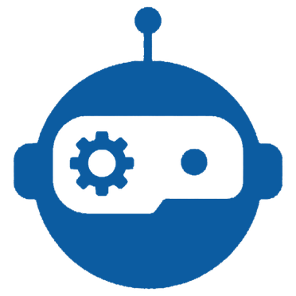
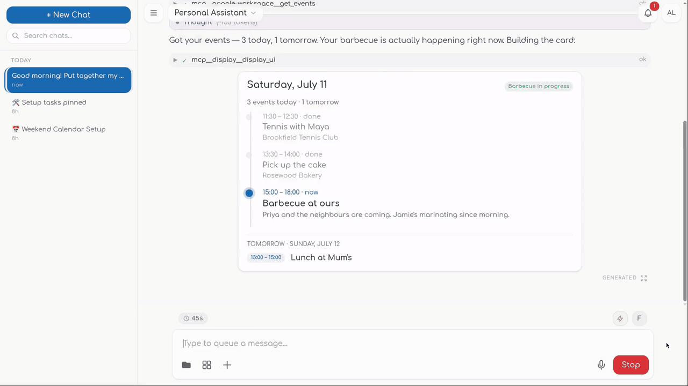
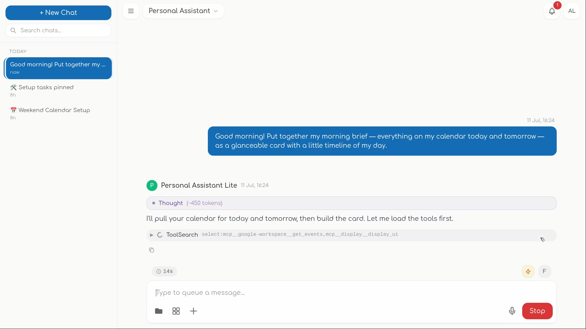
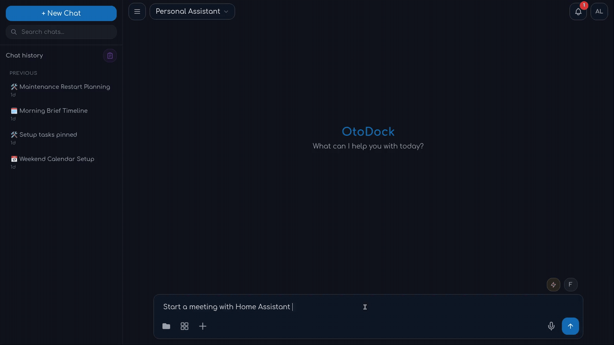
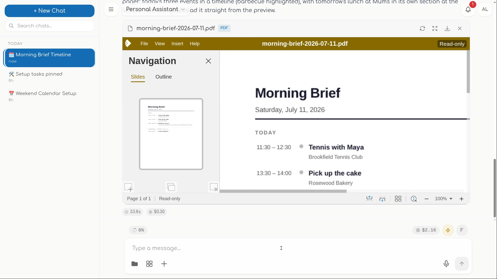

<p align="center">
  
</p>

<h1 align="center">OtoDock — Collaborative Agents</h1>

<p align="center">
  Run Claude Code and Codex as a team of agents for your whole company —<br/>
  on your own server, on the subscriptions you already pay for, with real tools and real security.
</p>

<p align="center">
  <a href="LICENSE"></a>
  
  <a href="https://docs.otodock.io"></a>
  <a href="https://otodock.io"></a>
</p>

<p align="center">
  <a href="https://otodock.io"></a>
</p>
<p align="center"><em><a href="https://otodock.io">Watch the full demo with sound on otodock.io</a></em></p>

---

OtoDock is a self-hosted platform for running a team of AI agents on
infrastructure you control. It runs the **real** Claude Code and Codex as its
engine — so your agents inherit everything the CLIs can do — and wraps them in
a live dashboard, a security model built for shared servers, and the plumbing
that turns a coding tool into a team of coworkers: schedules, triggers,
meetings, memory, documents, voice.

- **Your team's Claude Code / Codex, self-hosted.** Everyone connects the
  Claude or ChatGPT plan they already pay for (or API keys, or local models
  via Ollama), and works with agents from one dashboard.
- **Agents that can safely touch your homelab.** Every agent runs in a
  locked-down sandbox, isolated from your network by default — you grant
  access one folder or one service at a time.
- **Sovereign by design.** Chats, files, memory, and credentials live on
  hardware you run, and stay there.

## What your agents can do

### Chat & collaboration

Watch your agents actually work: every step streams in live — the reasoning,
each tool call, file edits as red/green diffs, plans and to-do lists ticking
off as the agent moves. Approve sensitive actions inline, or let trusted
agents run. And when one agent isn't enough, put specialists in one room:
**multi-agent meetings** run a moderated discussion where agents address each
other, answer in parallel, and converge — while you watch or join in.

<p align="center">
  
</p>

<p align="center">
  
</p>

- Live streaming chat with expandable tool detail, plan mode, subagents
- Multi-agent meetings with per-agent identity and cost
- Voice: hands-free conversations, dictation, and read-aloud in every chat
- Transparent, editable agent memory — every write visible, versioned, yours

### Automation

Your agents keep working when you close the tab. Schedule work on real
intervals — every 17 hours, every 3 days, exactly as you mean it — with every
run saved as a full conversation you can open and continue. Fire agents from
webhooks when something happens anywhere else. Notifications escalate through
four severities, up to a danger alarm that won't be missed.

### Documents & media

Agents produce actual Word, Excel, PowerPoint, and PDF files — tables,
charts, formatting — and the document opens right in the conversation in a
live editor you and your team can type into. Image generation and a
professional editing pipeline ride along.

<p align="center">
  
</p>

### Your AI, your tools

Bring the AI you already have: consumer Claude/ChatGPT subscriptions
(each person connects their own), provider API keys an admin can share, or
fully local models. Extend agents through MCP tool servers — drop in a
manifest, assign tools per agent — and install ready-made agents and tools
from the [community catalog](https://github.com/OtoDock/community-mcps) in
one click: a browser, GitHub, Notion, and a catalog that keeps growing.

### Security & teams

Built to be shared — and safe to let loose. Every server-side agent runs in
its own kernel sandbox with always-on network isolation; you grant access one
service at a time. SSO/OIDC, two-factor auth, per-agent roles, encrypted
credentials, scoped API keys, and per-user/per-agent budgets are all in the
box.

## Quick start

### Render

Deploy this fork via Blueprint (official image + managed Postgres + disk). See
[`RENDER.md`](RENDER.md). **No upstream code changes.** Verified Live deploy:
[`/health` on otodock.onrender.com](https://otodock.onrender.com/health) (Docker MCPs still unavailable without a host Docker socket).

[](https://dashboard.render.com/select-repo?type=blueprint)

### Docker (recommended)

The compose file is all you need — images are pulled from GHCR:

```bash
mkdir otodock && cd otodock
curl -fsSLO https://raw.githubusercontent.com/OtoDock/oto-dock/main/docker-compose.yml
echo "POSTGRES_PASSWORD=$(openssl rand -hex 24)" > .env
docker compose up -d
```

Then open **http://localhost:8400** — the setup wizard creates your admin
account, and you're chatting with your first agent minutes later. Set
`DASHBOARD_PUBLIC_URL` in `.env` if users browse to a different host, and
`PROXY_PORT` to move the published port ([`config.env.example`](config.env.example)
documents every knob; the platform auto-generates its remaining secrets on
first boot).

Building from source instead (contributors):

```bash
git clone https://github.com/OtoDock/oto-dock.git && cd oto-dock
printf 'POSTGRES_PASSWORD=%s\n' "$(openssl rand -hex 24)" > config.env
scripts/compose.sh up -d --build
```

### Bare metal (development)

On Debian/Ubuntu, one script bootstraps the pinned toolchain, a Postgres
container, and the built dashboard:

```bash
git clone https://github.com/OtoDock/oto-dock.git && cd oto-dock
scripts/dev-setup.sh            # add --service to install a systemd unit
```

See [`scripts/README.md`](scripts/README.md) for what it installs and
[`proxy/tests/README.md`](proxy/tests/README.md) for running the test suite.

## How it fits together

```
 dashboard/   React dashboard — chat, agents, tasks, files, admin
 proxy/       Platform core (FastAPI) — sessions, security, scheduling,
              the agent sandbox, and the WebSocket hub the dashboard talks to
 mcps/        MCP tool servers: OtoDock's custom set (files, memory, tasks,
              meetings, notifications, …) + community mirrors
 audio/       Speech package — STT / TTS / voice activity, provider-agnostic
 scripts/     Install, compose, backup/restore, and maintainer tooling
```

Agents run as real Claude Code / Codex processes inside per-session kernel
sandboxes, talk to their tools over MCP, and stream every step back to the
dashboard. PostgreSQL holds the platform state; everything ships as
containers (or runs bare-metal for development).

**Shipping next** — staged features you'll see land after launch: remote
machines (run agents with full access on your own laptop or servers), a live
terminal view, agents that answer real phone calls, the Android app, and more
integrations (Google Workspace, Slack, Linear, Microsoft 365, …).

## Community

- **Docs:** [docs.otodock.io](https://docs.otodock.io)
- **Website:** [otodock.io](https://otodock.io)
- **Community agents:** [OtoDock/community-agents](https://github.com/OtoDock/community-agents)
- **Community MCPs:** [OtoDock/community-mcps](https://github.com/OtoDock/community-mcps)
<!-- COMMUNITY: Discord invite lands here at launch (Phase 8) -->

Contributions are welcome — see [CONTRIBUTING.md](CONTRIBUTING.md). Security
reports: [SECURITY.md](SECURITY.md).

## License

OtoDock is **fair source**: licensed under the
[Functional Source License, v1.1, with Apache 2.0 future grant](LICENSE)
(FSL-1.1-Apache-2.0). You can use, run, modify, and redistribute it for
anything except competing with OtoDock commercially — and each version
automatically becomes plain **Apache 2.0 two years** after its release.

## A note from the author

OtoDock started with Claude Code: I wanted to use it beyond the terminal —
from anywhere, on my own infrastructure, wired into real automation — so I
built the platform around that idea. It has since become the place where my
own agents work: large parts of OtoDock were built, tested, and shipped by
agents running on OtoDock.

It's fair source so you can run it the same way, on your own hardware and
your own subscriptions. Use it, extend it, and tell me what it should do
next.

— Dimitris Mourtzis
